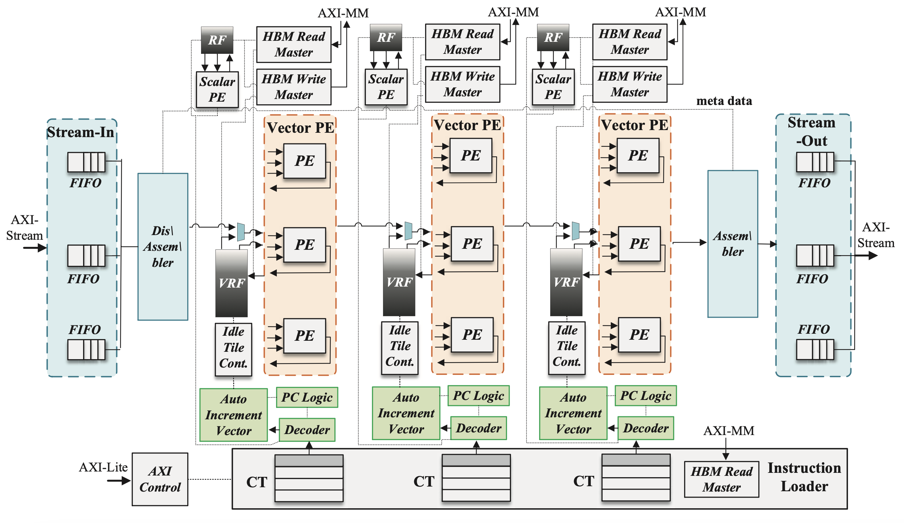

# Hardware Software Co-Design for Application-Level In-Switch/Near-Switch Processing 

This repository contains codebase for different types of advanced computing in the network (in or close to switches) using reconfigurable devices (FPGAs) that are useful for machine learning (ML) and HPC applications. Part of this repository is based on the paper "FLASH: FPGA-Accelerated Smart Switches with GCN Case Study" published in [ICS'23](https://dl.acm.org/doi/abs/10.1145/3577193.3593739). FLASH is a programmable stateful accelerator for ML and HPC applications that can be embedded into, or attached to, existing communication switches without significantly hampering throughput. This repository also contains codebase for running MPI collectives and examples of fused collectives. 

For in-switch computing, our accelerator is placed in the [NetFPGA-PLUS](https://github.com/NetFPGA/NetFPGA-PLUS) pipeline on an FPGA (FPGA-integrated-into-switch, FiS). For near-switch computing, an FPGA is attached to existing switches (FPGA-attached-switch, FaS). We use [CloudLab](https://www.cloudlab.us/) infrastructure for this case. Our accelerator is integrated into VNx networking kernel. For both cases, we use Alveo U280 FPGA boards. Our approach serves as an initial effort to enable application-level programmable packet processing within in-switch computing infrastructures.

## Repository Structure
Here is the structure of this repository:

~~~
├── FLASH
│   └── FLASH-FaS: FPGA-attached switch (CloudLab)
│   └── FLASH-FiS: FPGA-integrated switch (NetFPGA)
│   └── toolchain: compilation toolchain (from C/C++ packet handler to backend binary)
│   └── GCN-CPU: MPI CPU implementation of distributed SpMM (used in GCN inference)
│   └── GCN-GPU: PyTorch GPU code for GCN inference
│   └── GCN-results: reporting results and simulation for GCN inference performance (considering process skew) using traces and results from FLASH-FaS & FLASH-FiS
│   └── GCN-training: Pytorch code for GCN training on both CPU and GPU devices
├── collectives: host and FPGA kernel code for a set of collectives with FLASH-FaS
├── fused-collectives: host and FPGA kernel code for a sample of fused collective
~~~

## Features
FLASH benefits from the following features:
- Fine-granined communication 
- Overlap of computaion (leaf nodes) and communication (between leaf nodes & switch accelerator) 
- Deadline-based computing to improve reliability (packet loss)
- Keeps track of progress of each MPI rank
- Agnostic to the switch itself
- Programmable stateful accelerator
- Middleware (MPI) support
- Application-level processing (GCN case study)
- Complete toolchain from C/C++ to binary

## Architecture
This is the FLASH architecture.


**Data Plane:** is a 2D-array of PEs. The number of rows is equal to the number of SMD lanes (vectorization) and the number of col is equal to NUM_COL. At the input and output interface, there are a set of FIFOs. All of the PEs in the same column share an RF (on-chip memory) and an HBM (off-chip memory).

## How to run?

 ### FLASH/FLASH-FaS:
 - Development:
 First, clone this repository: 
 ```sh
cd FLASH/FLASH-FaS/intACiS
git clone https://github.com/Xilinx/xup_vitis_network_example.git --recursive
```
Then, use each file in the intACiS directory and replace the corresponding files in the VNx repo with them (left are the files in this repo and right are the files in VNx repo).
1. Makefile -> ./Makefile
2. Makefile_basic_kernel -> ./Basic_kernels/Makefile
3. connectivity_basic_if0.ini -> ./config_files/connectivity_basic_if0.ini
4. krnl_loopback.cpp -> ./Basic_kernels/src/krnl_loopback.cpp
 
 Next, use the below code (we used Vitis 2021.2) to generate the `.xclbin` file (vnx_basic_if0.xclbin):
  ```sh
export XILINXD_LICENSE_FILE=<IP address>  
source /tools/Xilinx/Vitis/2021.2/settings64.sh  
source /opt/xilinx/xrt/setup.sh  
export PATH=/tools/Xilinx/Vitis/2021.2/bin:$PATH  
export PATH=/tools/Xilinx/Vivado/2021.2/bin:$PATH
make all DESIGN=basic # INTERFACE=0
```
 - Deployment:

To deploy it on CloudLab, go to [CloudLab](https://www.cloudlab.us/) website, click on `Start Experiment`, choose `oct-u280-nic` profile (each node has 100G NIC and an FPGA and both are connected to a 100G switch), and then use 3 nodes (you can increase the number of nodes but you should change the kernel and host files accordingly). Once all nodes are in ready status and startup is finished, either open an terminal for each or SSH to them. Consider one node as FPGA node and the rest as leaf nodes. Use the following code to setup the FPGA node:
 ```sh
git clone https://github.com/Xilinx/xup_vitis_network_example.git
git clone https://github.com/pouya-haghi/ACiS.git
mkdir xup_vitis_network_example/binary
cp ACiS/FLASH/FLASH-FaS/intACiS/vnx_basic_if0.xclbin xup_vitis_network_example/binary
cd xup_vitis_network_example/Notebooks
```

Then, use the following code for all nodes:

 ```sh
sudo ifconfig enp175s0 <IP_100G_NIC> netmask 255.255.255.0 up # only for leaf nodes
sudo apt update
sudo apt install python3-pip  
pip3 install pynq==2.8.0.dev0
source /opt/xilinx/xrt/setup.sh # only for FPGA node
sudo apt install ipython3
ipython3
```
You can use `ifconfig` to find the IP address of 100G NICs (`IP_100G_NIC`). It should start with `enp175s0`. There is no need to use DASK.

Finally, run the corresponding part of `host.py` on each node (start with the FPGA node). Pay attention to the ordering for running the code on different nodes (documented in `host.py`).

> Note: `FLASH/FLASH-FaS` is designed and built incrementally from `collectives`.

 ## FLASH-FiS: 
 Go to the following directory:
  ```sh
cd FLASH/FLASH-FiS/hw/lib/std/CGRA_v1_0_0
```

Open up Vivado tool (we used version 2021.2). Choose Alveo U280 board. Include `src`, `test`, and `constr` folders from this repository. Regenerate the IPs. This design comes with AXI interfaces and HBM access and it is based on RTL kernel specifications. The top-level module for design is `top.sv` and for test is `test_top.sv`. The latter is already setup to capture the transitions of `ap_done` and valid signals and it reports the final execution time (in ps). It also measures `total_time sout` and `total_time sin` which are useful for getting throughput at input and output streaming interfaces. Now, you can synthesize design. The testbench needs the binary files for each VPE. So, first run `FLASH/toolchain/assembler/RISCV_Assembler.ipynb` to get the binaries. To simulate, then just run `test_top.sv`. Also, the files in `test/sync_FIFO` implements *UVM-like* testing in SystemVerilog for `sync_FIFO` module. 

 ### FLASH/toolchain:
 - Frontend Compiler:

It takes C/C++ packet handler and outputs an LLVM IR file (`.ll`). First, install LLVM 11.1.0 using [this link](https://releases.llvm.org/11.0.1/docs/GettingStarted.html). Then add the installation path to your `PATH` environment variable. Then, run the below file:

  ```sh
./compile_gcn.sh
```

It takes `gcn.cpp` and outputs `gcn.ll`.

- Backend Compiler:

It takes `.ll` file generated from the frontend compiler and outputs the assembly (`.asm`) file. To use this custom compiler, run `test_riscv_dfg.py` file. It takes `gcn_strip.ll` which is the stripped version of `gcn.ll` that is itself emitted from `gcn.cpp`. Below is the full code for how to use the compiler and resolve dependencies. We ran it on CentOs.

  ```sh
sudo yum install graphviz
sudo pip3 install pygraphviz
sudo pip3 install networkx
sudo pip3 install matplotlib
sudo pip3 install regex
python3 test_riscv_dfg.py
```

- Assembler:

It takes the assembly code generated by the compiler and spits out the binary that has the support of a subset of scalar and vector RISCV instructions. `gcn_xv_used.asm` or `gcn_vx_used.asm` in `Assembly_code` folder, can be used as the assembly code. The former is based on the output stationary and weight stationary dataflow, respectively (see the ICS paper). Simply run `RISCV_Assembler.ipynb`. There is also a sample code for how to implement collectives with FLASH (see `Assembly_code/collective.asm`) there. 

- Packager:

Packager takes in the binary file and outputs a `.pkg` file. The .pkg file is necessary since the host file for FPGA device needs a specific format (using a number of 512 bit channels) to load instructions from host memory to device memory. Simply run `packager.ipynb`. It takes `sample_test_intACiS.bin` and outputs `sample_test_intACiS.pkg`.

### FLASH/GCN-training
It trains different GCN datasets on a GPU device. We used an Nvidia V100 GPU. We used DGL library with PyTorch framework (CUDA 11.3 and PyTorch 1.10). Simply run `train_gpu.ipynb`. It has functions for saving weights and hidden features into `data` folder. 

> Note: There is a folder named `archive` that contains an older version of code for GCN training using a CPU device. 

### FLASH/GCN-GPU
It performs inference on different GCN datasets using a GPU device. We used an Nvidia V100 GPU. We used DGL library with PyTorch framework (CUDA 11.3 and PyTorch 1.10). Simply run `inference.ipynb`.  It loads data from previously stored during GCN training. It measures time in milliseconds.

### FLASH/GCN-CPU

This is MPI code for the distributed GCN inference by breaking it into sparse matrix multiplications (SpMM). We followed the Allgather-based communication pattern for distributed SpMM. For small-scale datasets (PPI, Citeseer, Pubmed), use the following code to compile `SDMatMul.cpp` and then submit the batch job. For large-scale datasets (ogbn-mag, ogbn-products), modify `Makefile` to use `SDMatMul_largedataset.cpp` instead. We used Stampede2 cluster at TACC to run the code.

  ```sh
cd FLASH/GCN-CPU
make all
sbatch script/script_16node_1rank
```

For small-scale datasets, data needed by the code (adjacency matrix and hidden features) are included in `data` folder. There are also sample results for small-scale datasets in `GCN_results_16node`.

> Note: There are also codes using PETSc library.
> Note: The format of script files are: script_"#_OF_NODES"node_"#_OF_PROCESSES_PER_NODE"rank

### FLASH/GCN-results
It simulates the performance of both FLASH and baseline CPU (without FLASH) and reports the results (performance and breakdown of communication and computation). Simply run `GCN_results.ipynb`. It takes in the results from `GCN-CPU` (SpMM timings including process skew) and `FLASH-FiS`/`FLASH-FaS` depending on the acceleration scenario. For the FLASH, it considers the process skew when entering into FPGA offload. It has also helper functions for emulating a high-radix switch performance (queueing model) and emulating FLASH accelerator performance based on only the number of packet handler instructions, and finally an example for reduction. Some sample results (input to the simulator, not output) for 16 nodes are under `GCN_results` folder.

### collectives
There are a set of collectives (Reduce, Allreduce, Allgather) for FaS acceleration type. The structures of files in tis directory is similar to that of `FLASH/FaS`. FPGA image binaries (`.xclbin`) are also provided for each collective. 

> Note: `archive` folder contains older versions. For example, `3node_IntReduce_stats` outputs some metadata information (port #, IP, etc) and `3node_loopback` simply loopbacks data to the source node.

Inside `MPI` folder, there is a lightweight MPI-like runtime environment for running the processes required on several leaf nodes from the host node. Simply run `MPI.py`. This program takes in an argument file with several arguments which are described below. At a high level, it takes in the `hostfile` (that has IP addresses of each rank) and the number of processes (`np`). It does SSH to leaf nodes, creates new processes there (and assigns new port numbers for each). 

These are the versions we used:
- Python version = 3.10.12
- Python Packages
  - paramiko==3.2.0
  - pynq==2.8.0.dev0

**Arguments File:** The program is designed to take in a single arguments file with each argument listed rather than have a long list of arguments in the command line. Each argument in the argument file needs to be on its own line. The format of specifying an argument is, `[argument name]=[value]`. Some of the arguments are required and others are optional. 

##### The required arguments are:
- `np=[positive integer]` This is the total number of processes to to be run.
- `hostfile=[path to hostfile]` This is the path to the hostfile (see hostfile below for more information).
- `xclbin=[path to binary]` This is the path to the `.xclbin` binary file that is used to program the FPGA
- `dir=[path to working directory]` This is the path to where the files will be transferred and executed on the leaf nodes.
- `size=[size in bytes]` This is the decimal value of the size in bytes that are to be transferred.
- `user=[username on leaf nodes]` This is the username that is used to establish a SSH connection.
- `n=[Integer value]` Number of nodes. There are two ways to specify how many processes to run on nodes. If you do not specify the slot numbers for each node in the nodes, you must specify how many nodes exist with this argument.

##### The optional arguments are:
- `key_path=[key]` This is the path to the key needed for connecting to the leaf nodes.
- `env_path=[users/someone/devenv]` This is the path to the environment directory if you have a virtual environment set up.
- `node_script=node_script.py` This is the path to the script that you will be running on the leaf nodes. The default value is `node_exec.py`. However if you have moved the file or want to use a different one you can specify it here.
- `alveo_ip=[IP address as string]` This is defaulted to `192.168.40.8` but you can override it with this argument.
- `alveo_port=[port number]` This is defaulted to `62781` but if you are using a different port for the FPGA you can override it with this argument.
- `node_ctrl=[path to node control script]` This is the script that executes the `node_script.py` file on the leaf nodes. Generally, it should not be changed unless you have moved or changed the file.
 
**Hostfile:** In the hostfile each node's IP address must be specified on its own line. If the number of slots are specified the program will attempt to fill the slots from top to bottom until `np` processes are created. With this option the `n` argument will be ignored.
```
192.168.40.11 slots=1
192.168.40.12 slots=1
```
Alternatively, you can simply enter each IP address per line. If you choose this option, you must specify a valid argument for `n`. The number of processes per node will be then `np/n`.
```
192.168.40.11
192.168.40.12
```

### fused-collectives
There is a sample fused collective (Allgather-op-allgather) where op is a reduction of every grouped 16 elements. The structure of files is similar to `collectives` folder.


## Versions:
